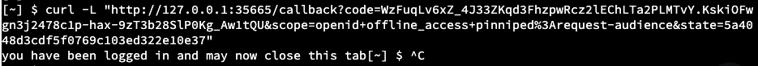

In this workshop, TKG version used is v1.4.1
For detailed Installation procedure, refer to official vmware doc. We have already installed the required CLI tools for this workshop. 

```dashboard:open-url
url: https://docs.vmware.com/en/VMware-Tanzu-Kubernetes-Grid/1.4/vmware-tanzu-kubernetes-grid-14/GUID-index.html
```

##### Click text to Hello world (with target)

```execute-1
echo "Hello, Welcome to Partner workshop session"
```

##### Click here to check Tanzu version

```execute
tanzu version
```

##### Click here to check TMC CLI version

```execute
tmc version
```

##### Click here to check terraform CLI version

```execute
terraform --version
```

##### Click here to check AZ CLI version

```execute
az --version
```

##### Export session name as env variable

```execute-all
export SESSION_NAME={{ session_namespace }}
```

##### Set up the environment

```execute-1
source ~/script-session.sh
```

### Preparing your setup

<p style="color:red"><strong>Please wait for 3-5 mins. Continue once the ongoing task is completed in Terminal-1.</strong></p>

##### Connect to jumpbox in Terminal-2 to deploy a Management cluster

```execute-2
ssh -i id_rsa azureuser@{{ session_namespace }}.centralindia.cloudapp.azure.com -o StrictHostKeyChecking=accept-new
```

##### Deploy management cluster using bind. Once this command is executed, wait for a min and then proceed with next command to access the Installer page. 

```execute-2
tanzu management-cluster create --ui --bind 0.0.0.0:8080
```

##### Access below url and select Microsoft Azure in Installer page

```dashboard:open-url
url: http://{{ session_namespace }}.centralindia.cloudapp.azure.com:8080
```
    
##### Azure environment details for management cluster creation can be found by executing this command: 

```execute
cat /home/eduk8s/creds-tkg
```
    
<p style="color:red"><strong>Copy and paste the values in Installer page opened in browser.</strong></p>


##### Fill Iaas provider details as shown in creds-tkg file: 

###### Region: West US 2

---------------------

Resource Group: Create a new resource group and provide below name: 

<style>
H5{color:Blue !important;}
H6{color:DarkOrange !important;}
</style>

###### {{ session_namespace }}-RG

<p style="color:black"><strong>Example:</strong></p>


----------------------
    
Azure VNET Settings: 
    
Create a new VNET on Azure > from drop down select the newly created RG:
    
###### {{ session_namespace }}-RG

-----------------

Provide VNET name as:

###### {{ session_namespace }}-vnet

-----------------

Control Plane subnet name : 
###### {{ session_namespace }}-cp

----------------

Worker node subnet name: 
###### {{ session_namespace }}-worker 

<p style="color:black"><strong>Example:</strong></p>


-----------------

Management Cluster Settings: Select <p style="color:orange"><strong>Development</strong></p>

-----------------

###### Instance Type: Standard_D2s_v3

-----------------
    
Management Cluster Name: 
######    {{ session_namespace }}-mgmt

-----------------
    
###### Worker Node Instance Type: Standard_D2s_v3

-----------------

<p style="color:black"><strong>Example:</strong></p>


###### Click NEXT

-----------------
    
###### Metadata: Leave to default and click NEXT

-----------------

###### Kubernetes Network: Leave to default and click NEXT
    
-----------------
-----------------
    
###### Identity Management: Enable Identity Management Settings > Select LDAPS

-----------------

###### LDAPS Endpoint: partnerdemo.captainvirtualization.in

-----------------

###### port: 636

-----------------

###### BIND DN (OPTIONAL) : cn=partnerse-admin,cn=Users,dc=partnerdemo,dc=captainvirtualization,dc=in

-----------------

###### BIND PASSWORD (OPTIONAL) : Welcome11!

-----------------

##### User Search Attributes


###### BASE DN (OPTIONAL) : cn=Users,dc=partnerdemo,dc=captainvirtualization,dc=in

-----------------

###### FILTER (OPTIONAL) : (objectClass=Person)

-----------------

###### USERNAME (OPTIONAL) : userPrincipalName

-----------------

##### Group Search Attributes


###### BASE DN (OPTIONAL) : dc=partnerdemo,dc=captainvirtualization,dc=in

-----------------

###### FILTER (OPTIONAL) : (objectClass=group)

-----------------

###### NAME ATTRIBUTE (OPTIONAL) : cn

-----------------

###### USER ATTRIBUTE (OPTIONAL) : DN

-----------------

###### GROUP ATTRIBUTE (OPTIONAL) : member

-----------------

##### ROOT CA (OPTIONAL) 

```execute-1
cat ~/ldap-ca.pem
```
-----------------

##### VERIFY LDAP CONFIGURATION (OPTIONAL) : 


###### verify LDAP configuration : In TEST USER NAME field, use any of the below user to verify the load configuration

|     User Name             |    Password     |
|    :---:                  |    :---:        |
|    partnerse-user1        |    Welcome11!   |
|    partnerse-user2        |    Welcome11!   |
|    partnerse-user3        |    Welcome11!   |
|    partnerse-user4        |    Welcome11!   |
|    partnerse-user5        |    Welcome11!   |
|    partnerse-user6        |    Welcome11!   |
|    partnerse-user7        |    Welcome11!   |
|    partnerse-user8        |    Welcome11!   |
|    partnerse-user9        |    Welcome11!   |
|    partnerse-user10       |    Welcome11!   |
|    partnerse-user11       |    Welcome11!   |
|    partnerse-user12       |    Welcome11!   |
|    partnerse-user13       |    Welcome11!   |
|    partnerse-user14       |    Welcome11!   |

###### Click START

Expected result: 

<p style="color:black"><strong>Example:</strong></p>


-----------------
-----------------
    
###### OS Image: from dropdown select Ubuntu-20.04


    
###### CEIP Agreement: Leave to default and click NEXT
    
###### Review Configuration and click on Deploy management cluster

<p style="color:black"><strong>Example:</strong></p>


    
### Cluster creation takes about 15 mins

###### Short video on TKG

```dashboard:open-url
url: https://www.youtube.com/watch?v=BCPU8rGDf_M
```

<p style="color:red"><strong>Please wait till the management cluster is created</strong></p>

##### Proceed further only once you see this on screen (terminal-2)

<p style="color:black"><strong>Example:</strong></p>


##### Check the contexts

```execute-2
kubectl config get-contexts
```

##### Check the management cluster info

```execute-2
tanzu mc get
```

##### Check resources in pinniped-supervisor namespace

```execute-2
kubectl get all -n pinniped-supervisor
```

##### Check resources in tanzu-system-auth namespace

```execute-2
kubectl get all -n tanzu-system-auth
```

##### Export the variable

```execute-2
export TANZU_CLI_PINNIPED_AUTH_LOGIN_SKIP_BROWSER=true
```

##### Generate a kubeconfig file

```execute-2
tanzu management-cluster kubeconfig get --export-file /tmp/ldaps-tkg-mgmt-kubeconfig
```

##### Lets deliver the config file to a user which we assume is using Terminal-1, lets copy the exported config from Terminal-2 (temporary JB) to Terminal-1

```execute-1
scp -i ~/id_rsa -o StrictHostKeyChecking=accept-new azureuser@{{ session_namespace }}.centralindia.cloudapp.azure.com:/tmp/ldaps-tkg-mgmt-kubeconfig .
```

##### Read the generated config file

```execute-1
cat ~/ldaps-tkg-mgmt-kubeconfig
```

##### In below clusterrolebinding file, provide the username that you wish to authenticate. Usernames can be anything between partnerse-user1 to partnerse-user14 For ex: replace username@partnerdemo.captainvirtualization.in with partnerse-user6@parterdemo.captainvirtualization.in

```execute-2
vi ~/clusterrolebinding.yaml
```

##### Create cluster role binding as admin 

```execute-2
kubectl apply -f ~/clusterrolebinding.yaml
```

```execute-2
cat ~/clusterrolebinding.yaml
```

#### Stop the Jumpbox, continue further once the task is completed. 

```execute-1
az vm stop -n {{ session_namespace }} -g {{ session_namespace }}-JB
```

```execute-1
kubectl --kubeconfig=ldaps-tkg-mgmt-kubeconfig get nodes
```
###### Example:


###### The login URL is displayed in terminal-1. copy the url and paste in local browser. 


##### LDAP Username: "ldap user name as given in clusterrolebinding.yaml file"@partnerdemo.captainvirtualization.in
##### Password: "Password as given in above credentials screenshot"

###### Ref Screenshots: 


    

    
##### Run curl command in Terminal-2 with the url that is copied earlier. 

```copy-and-edit
curl -L "paste the url copied earlier that starts with http://127.0.0.1/"
```
###### Note: In Terminal-2, right click and paste to edit above curl command. 

<p style="color:black"><strong>Example:</strong></p>



##### Expected result: you have been logged in and may now close this tab
    
##### This script copies the config file into .kube  directory

```execute-1
cp ldaps-tkg-mgmt-kubeconfig ~/.kube/config
```

###### Tanzu login

```execute-1
tanzu login --kubeconfig ~/.kube/config --context tanzu-cli-{{ session_namespace }}-mgmt@{{ session_namespace }}-mgmt --name tanzu-cli-{{ session_namespace }}-mgmt
```    

##### Set the context

```execute-1
kubectl config use-context tanzu-cli-{{ session_namespace }}-mgmt@{{ session_namespace }}-mgmt
```

##### Verify the context and it shouldn't be admin
    
```execute-1
kubectl config get-contexts
```

##### After successful login as LDAP user, you should see the output of below commands. 

```execute-1
kubectl get nodes
```

```execute-1
kubectl get pods -A
```

##### Read the config file to understand the variables defined for Tanzu Kubernetes cluster which will be deployed shortly

```execute-1
cat /home/eduk8s/wc-config.yaml
```

#### Click here to deploy workload cluster. 

```execute-1
tanzu cluster create {{ session_namespace }} -f /home/eduk8s/wc-config.yaml
```

##### Now the cluster is deployed using LDAP user. 

Meanwhile you can check the cluster creation logs in Terminal 2

##### Click here to check the progress of workload creation from logs

```execute-2
podname=$(kubectl get pods -n capz-system -o=jsonpath={.items[0].metadata.name})
kubectl logs $podname -n capz-system -c manager -f
```
###########################################################
#### Wait for the cluster to get created ##################
###########################################################

###### Doc for ref: 

```dashboard:open-url
url: https://docs.vmware.com/en/VMware-Tanzu-Kubernetes-Grid/1.5/vmware-tanzu-kubernetes-grid-15/GUID-tanzu-k8s-clusters-index.html
```

```execute-2
<ctrl+c>
```

##### Proceed further only once you see this on screen (terminal-1)

<p style="color:black"><strong>Example:</strong></p>


#### Click here to check the deployed workload clusters 
```execute-1
tanzu cluster list
```

##### Get credentials and export the config file
```execute
tanzu cluster kubeconfig get {{ session_namespace }} --admin --export-file ~/.kube/config-tkg
```
##### Read the kubeconfig file
```execute
cat  ~/.kube/config-tkg
```
##### Click here to change the context from management cluster to workload
```execute
kubectl config use-context {{ session_namespace }}-admin@{{ session_namespace }} --kubeconfig /home/eduk8s/.kube/config-tkg
```
##### Verify the context
```execute
kubectl config get-contexts --kubeconfig /home/eduk8s/.kube/config-tkg
```
##### Check the nodes in workload cluster
```execute
kubectl get nodes -A --kubeconfig /home/eduk8s/.kube/config-tkg
```
##### Check the pods in workload cluster
```execute
kubectl get pods -A --kubeconfig /home/eduk8s/.kube/config-tkg
```

#### Deploy a test application in workload cluster

##### Create namespace test-application in workload cluster which will be used to deploy an application
```execute
kubectl create ns test-application --kubeconfig /home/eduk8s/.kube/config-tkg
```
    
##### Check all the namespaces in workload cluster
```execute
kubectl get ns --kubeconfig /home/eduk8s/.kube/config-tkg
```
    
##### Create a deployment with 2 replicas
```execute
kubectl create deployment spring-deploy --port=8080 --image=eknath009/tbs-spring-image:3 --replicas=2 -n test-application --kubeconfig /home/eduk8s/.kube/config-tkg
```
    
##### Expose the deployment 
    
```execute
kubectl expose deployment spring-deploy --port=8080 --type=LoadBalancer -n test-application --kubeconfig /home/eduk8s/.kube/config-tkg
```
    
##### Collect the External IP and access the same in browser with port 8080, wait for a min and execute again

```execute
kubectl get svc -n test-application --kubeconfig /home/eduk8s/.kube/config-tkg
```
    
##### Access the application on port 8080
    
```dashboard:open-url
url: http://externalipcollectedabove:8080
```

############################################################
#### Inform VMware SE if application is not accessible #####
############################################################

<p style="color:black"><strong>Example:</strong></p>


##### Delete the test application

```execute
kubectl delete ns test-application --kubeconfig /home/eduk8s/.kube/config-tkg
```

##### Variable interpolation

workshop_name: {{ workshop_name }}

session_namespace: {{ session_namespace }}

workshop_namespace: {{ workshop_namespace }}

training_portal: {{ training_portal }}

ingress_domain: {{ ingress_domain }}

ingress_protocol: {{ ingress_protocol }}

#### Web site links

[Create TKG Cluster](https://docs.vmware.com/en/VMware-Tanzu-Kubernetes-Grid/1.5/vmware-tanzu-kubernetes-grid-15/GUID-tanzu-k8s-clusters-azure.html)
