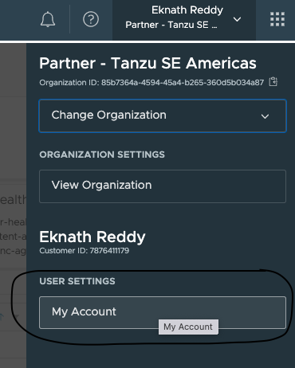
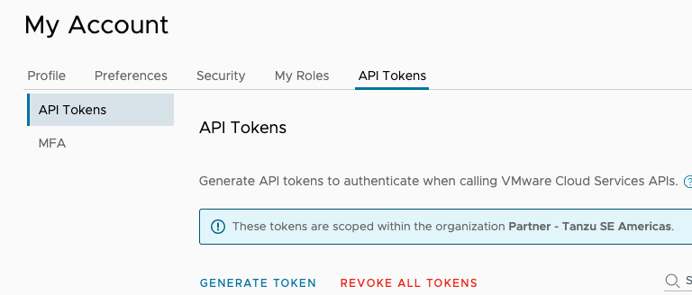
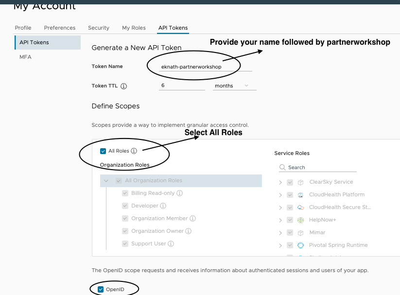
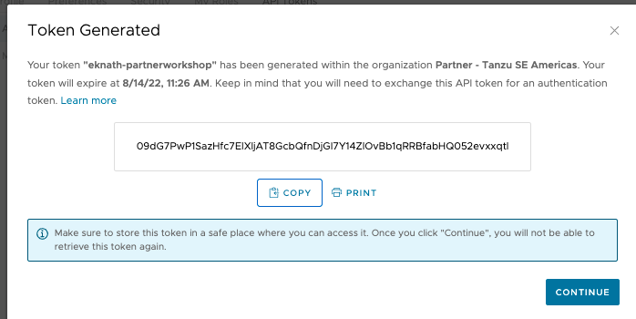
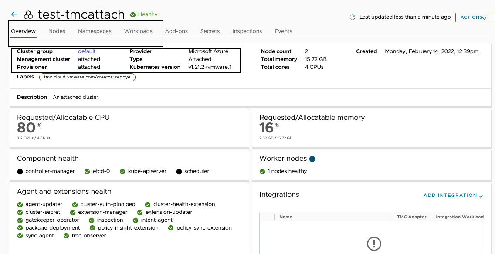

In this section, Lets explore about TMC CLI by running some basic operations. 

#### Follow the below steps to get API Token from TMC console

```dashboard:open-url
url: https://partnertanzuseamericas.tmc.cloud.vmware.com/
```
Navigate to TMC console > My Account > API Token > Generate Token





Provide your name followed by partnerworkshop
select All Roles



##### Copy the token and save it for later use ####



##### Authenticate to TMC

```execute
tmc login -n {{ session_namespace }} --no-configure
```
###### Provide API Token
###### Login context name(leave to default) - Press Enter

```execute
tmc system context configure -l "log" -m {{ session_namespace }}-mgmt
```

##### List the available management cluster

```execute
tmc managementcluster list
```

##### Create Cluster group: {{ session_namespace }}-cg

```execute
tmc clustergroup create --name {{ session_namespace }}-cg --description "Workshop of {{ session_namespace }}"
```

##### List the cluster groups and verify if the created cg: {{ session_namespace }}-cg  is shown in the list

```execute
tmc clustergroup list
```

##### Register the management cluster (created in previous section) {{ session_namespace }}-mgmt into TMC

```execute
tmc managementcluster register {{ session_namespace }}-mgmt  -k ~/.kube/config -p TKG -c {{ session_namespace }}-cg
```

##### Wait for the registration to complete, ETA: 2 mins

##### List the management clusters and verify if registered management cluster {{ session_namespace }}-mgmt is shown in the list

```execute
tmc managementcluster list
```

##### Check resources in vmware-system-tmc namespace
Dont worry if some pods are in creating state, it generally takes few minutes to complete. 

```execute
kubectl get all -n vmware-system-tmc
```

##### It takes few mins to turn healthy

```execute
tmc managementcluster get {{ session_namespace }}-mgmt
```

##### Check in TMC Console to know the status of management cluster

Navigate to TMC console > Administration > Management clusters > click on {{ session_namespace }}-mgmt

```dashboard:open-url
url: https://partnertanzuseamericas.tmc.cloud.vmware.com/
```

##### Attach the workload cluster (created in previous section) {{ session_namespace }} using TMC CLI, wait for the process to complete. 

```execute
tmc cluster attach -g {{ session_namespace }}-cg -n {{ session_namespace }} -m {{ session_namespace }}-mgmt -p TKG --kubeconfig ~/.kube/config-tkg
```

##### Check in TMC Console to know the status of attached workload cluster

Navigate to  TMC console > Clusters > click on clustername {{ session_namespace }}



```execute
tmc cluster validate --kubeconfig ~/.kube/config-tkg
```
