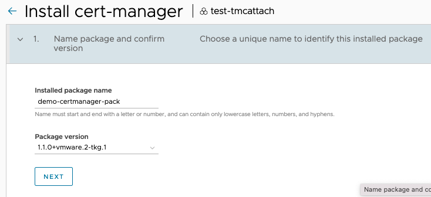
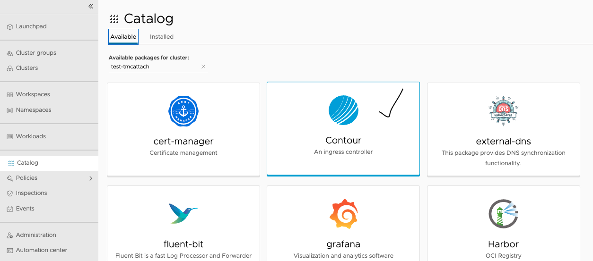
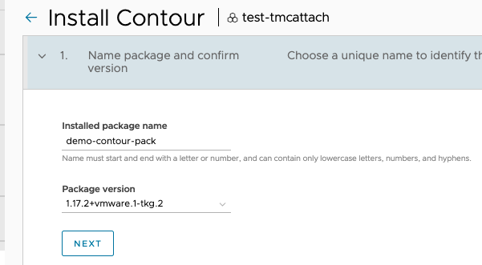
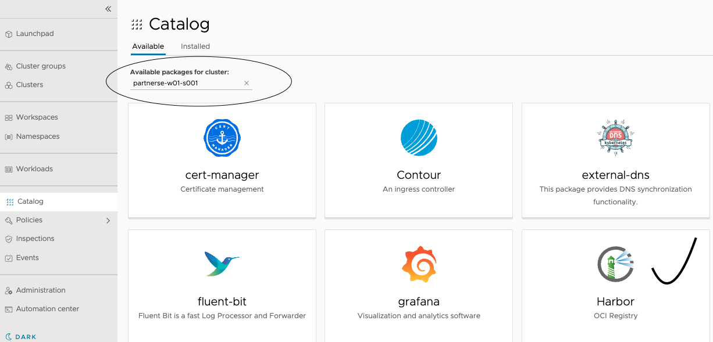
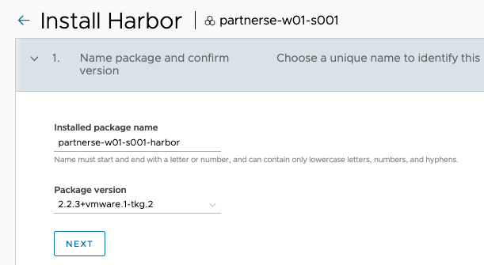
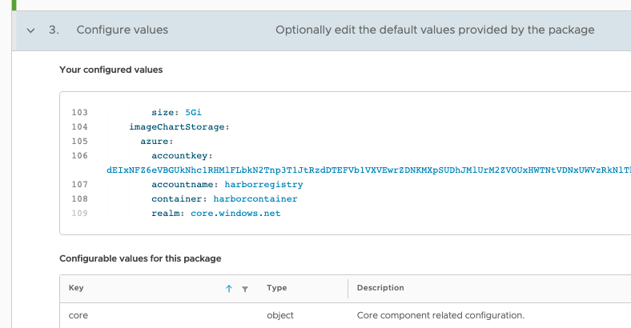
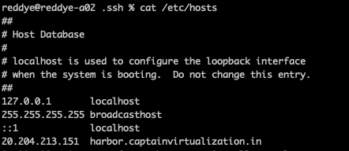
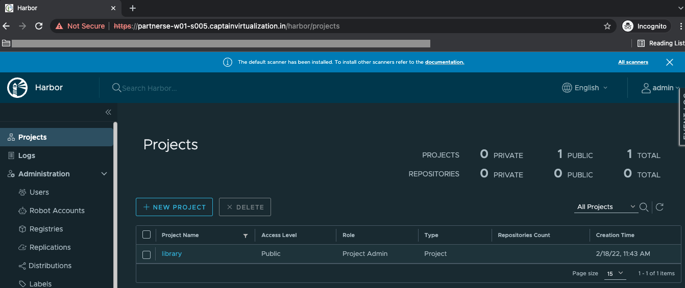

In this section, lets see the procedure to push packages(catalog) from TMC cli and console. 

```dashboard:open-url
url: https://docs.vmware.com/en/VMware-Tanzu-Mission-Control/services/tanzumc-using/GUID-EF35646D-8762-41F1-95E5-D2F35ED71BA1.html
```
#### Install cert-manager Package using TMC CLI: 

Navigate to TMC console > Catalog > select cluster {{ session_namespace }} from drop down and click on cert-manager


Click on Install Package which can be found on top right side of the page


Name the Installed package name as : {{ session_namespace }}-certm and click NEXT



Leave to Default and click NEXT

Install Package

##### Verify the pods

```execute
kubectl get pods -n cert-manager
```

Navigate to TMC console > Catalog > Installed > check if the package (cert-manager.tanzu.vmware.com) is succeeded and healthy


#### Install Contour Package using TMC CLI: 

Navigate to TMC console > Catalog > select cluster {{ session_namespace }} from drop down and click on Contour



Click on Install Package which can be found on top right side of the page


Name the Installed package name as : {{ session_namespace }}-contour and click NEXT



### Execute the command to see the config values in Terminal-2

```execute-2
cat ~/contour.yaml
```

 

Leave to Default and click NEXT

Install Package

Navigate to TMC console > Catalog > Installed > check if the package (cert-manager.tanzu.vmware.com) is succeeded and healthy

 

##### Verify the envoy Load Balancer, this IP will be used later. 

```execute
kubectl get svc -n tanzu-system-ingress --kubeconfig ~/.kube/config-tkg
```

#### Install Harbor Package using TMC CLI: 

Navigate to TMC console > Catalog > select cluster {{ session_namespace }} from drop down and click on Harbor



Click on Install Package which can be found on top right side of the page

Name the Installed package name as : {{ session_namespace }}-harbor and click NEXT



### Execute the command to see the config values in Terminal-1

```execute-1
cat ~/harbor.yaml
```
Copy the values from harbor.yaml and paste in TMC configure values page as shown below: 



Leave to Default and click NEXT

Install Package

##### Verify the pods, this might few mins to complete

```execute-1
kubectl get pods -n tanzu-system-registry --kubeconfig ~/.kube/config-tkg
```

##### Node the Load Balancer IP and make an entry in your local machine /etc/hosts mapping the IP to {{ session_namespace }}.captainvirtualization.in

```execute-1
kubectl get svc -n tanzu-system-ingress --kubeconfig ~/.kube/config-tkg
```

## Example: 


```dashboard:open-url
https://{{ session_namespace }}.captainvirtualization.in/
```

Enter the credentials: admin, Newstart@1


