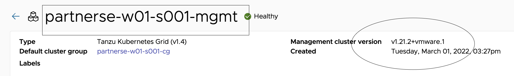
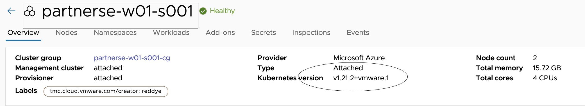
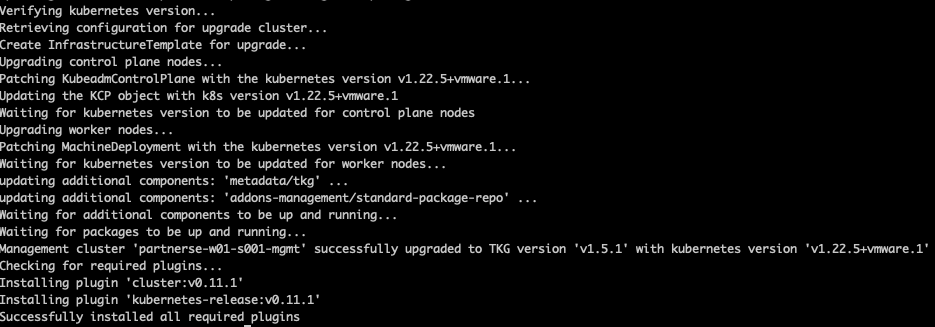
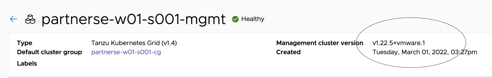
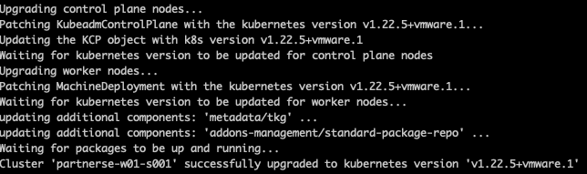
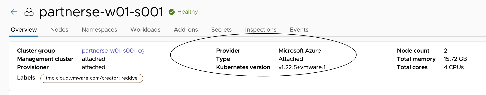

## In this section, lets upgrade the deployed Management and workload clusters to 1.5.1

lets do the prechecks before starting with cluster upgrade. 

Navigate to TMC console > Administration > Management clusters {{ session_namespace }}-mgmt



Navigate to TMC console > Clusters > click on clustername {{ session_namespace }}



###### Start the JB vm

```execute-1
az vm start -n {{ session_namespace }} -g {{ session_namespace }}-JB
```

### Connect using DNS hostname

```execute-2
ssh -i id_rsa azureuser@{{ session_namespace }}.centralindia.cloudapp.azure.com -o StrictHostKeyChecking=accept-new
```

###### Upgrade the CLI and required tools to 1.5.1

```execute-2
/bin/sh ~/script-session-upgrade.sh
```

###### Verify the Tanzu CLI Version

```execute-2
tanzu version
```

###### Verify Kubectl version

```execute-2
kubectl version
```

###### Check the current contexts

```execute-2
kubectl config get-contexts
```

###### Initiate the management cluster upgrade to 1.5.1, this should take around 30 mins to complete

```execute-2
tanzu management-cluster upgrade {{ session_namespace }}-mgmt --os-name ubuntu --os-version 20.04 --os-arch amd64 -y
```

#####################
# BREAK TIME
#####################

##### Once the management cluster is upgraded: 



Navigate to TMC console > Administration > Management clusters {{ session_namespace }}-mgmt



##### List the clusters

```execute-2
tanzu cluster list --include-management-cluster
```

###### Info about kubernetes releases

```execute-2
tanzu kubernetes-release get
```

###### Upgrades available for a workload cluster

```execute-2
tanzu cluster available-upgrades get {{ session_namespace }}
```

###### Trigger workload cluster upgrade to 1.5.1, this should take around 15 mins to complete. After successfull completion, version should be v1.22.5+vmware.1 for both clusters

```execute-2
tanzu cluster upgrade {{ session_namespace }} -y
```

##### List the clusters and now the version should be 

```execute-2
tanzu cluster list --include-management-cluster
```

##### Once the management cluster is upgraded: 



Navigate to TMC console > Clusters > {{ session_namespace }}



