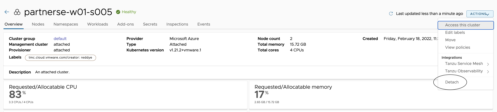
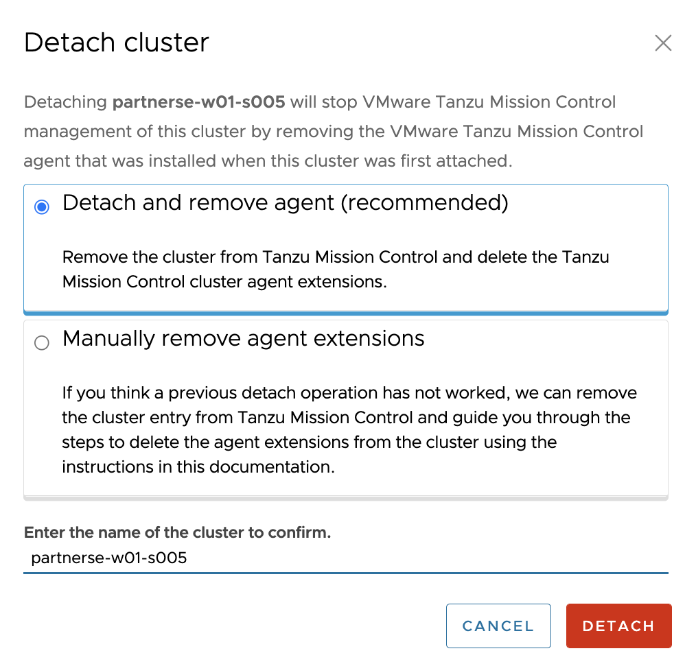
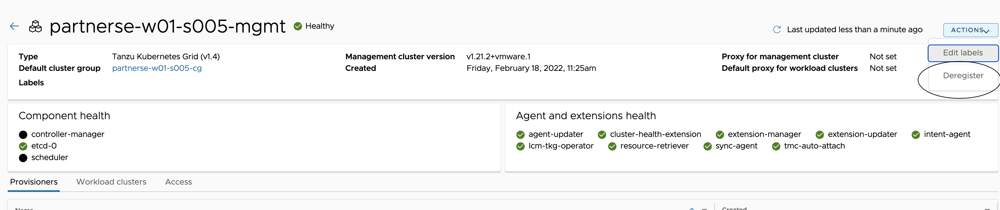
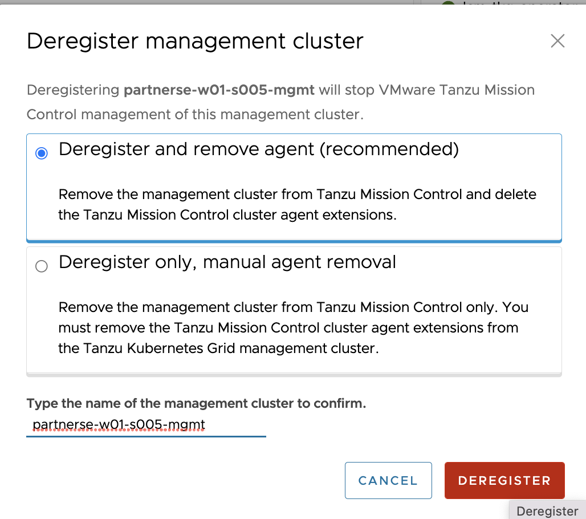

## In this section, lets see the procedure to detach the clusters from TMC console and delete management, workload clusters. 

#### DETACH Workload cluster from TMC Console

###### Navigate to TMC console > Clusters > select the cluster {{ session_namespace }} > Actions (can be located in top right corner) > Detach 

###### Example: 



###### Provide name: {{ session_namespace }}

DETACH

###### Example: 



##### Verify the pod status, should take few mins to complete

```execute
kubectl get pods -n vmware-system-tmc --kubeconfig ~/.kube/config-tkg
```

#### Deregister Management cluster from TMC console

###### Navigate to TMC console > Administration > Management clusters > click on {{ session_namespace }}-mgmt > Actions (can be located in top right corner) > Deregister 

###### Example: 



###### Provide name: {{ session_namespace }}-mgmt

DEREGISTER

###### Example: 



##### Verify the pod termination status in management cluster context, should take few mins to complete

```execute
kubectl get pods -n vmware-system-tmc
```

##### List the management clusters and {{ session_namespace }}-mgmt should be missing

```execute
tmc managementcluster list
```

```execute
tmc clustergroup list
```

#### Delete workload cluster using Tanzu CLI, should take few mins to complete

```execute-2
tanzu cluster delete {{ session_namespace }} -y
```

```execute-2
tanzu cluster list
```

##### Proceed further once the workload cluster is deleted completely

#### Delete Management cluster using Tanzu CLI, should take few mins to complete

```execute-2
tanzu mc delete -y
```

###### Terminate the Jumpbox

```execute-1
az group delete -n {{ session_namespace }}-JB --yes
```

#### Delete the localhost file

###### In your local machine, delete the entry that has hostname mapped with name {{ session_namespace }}.captainvirtualization.in from /etc/hosts
