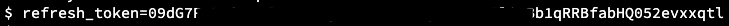

In this section, lets explore few rest API's. you can find complete list of API's in:

```dashboard:open-url
url: https://developer.vmware.com/apis/897/tanzu-mission-control
```

#### fetch API Token: 

###### Replace: replace me with TMC API Token> with API Token collected in TMC section 

```copy-and-edit
refresh_token=<replace me with TMC API Token>
```
###### Note: In Terminal-1, just right click and paste to edit above curl command 


  
##### Generate Access token from above Refresh Token

```execute
access_token=$(curl -d "refresh_token=$refresh_token" https://console.cloud.vmware.com/csp/gateway/am/api/auth/api-tokens/authorize | jq -r '.access_token')
```

##### Read the Access Token

```execute
echo $access_token
```

#### Verify the access(Optional) using access token

```dashboard:open-url
url: https://jwt.io/
```


##### Get the organization ID and account details 

```execute
curl -s --request POST --url https://console.cloud.vmware.com/csp/gateway/am/api/auth/api-tokens/details --header 'content-type: application/json' --data '{"tokenValue":"'"$refresh_token"'"}' | jq '.'
```

##### Get the cluster groups

```execute
curl -s 'searchScope.name=*' https://partnertanzuseamericas.tmc.cloud.vmware.com/v1alpha1/clustergroups -H "Authorization: Bearer $access_token" | jq '.clusterGroups[].fullName.name'
```

##### Get the clusters 

```execute
curl -s 'searchScope.name=*' https://partnertanzuseamericas.tmc.cloud.vmware.com/v1alpha1/clusters -H "Authorization: Bearer $access_token" | jq '.clusters[].fullName.name'
```

##### Get the management clusters 

```execute
curl -s 'searchScope.name=*' https://partnertanzuseamericas.tmc.cloud.vmware.com/v1alpha1/managementclusters -H "Authorization: Bearer $access_token" | jq '.managementClusters[].fullName.name'
```

##### Delete the cluster group {{ session_namespace }}-cg that is created earlier: 

```execute
curl -X DELETE https://partnertanzuseamericas.tmc.cloud.vmware.com/v1alpha1/clustergroups/$SESSION_NAME-cg -H "Authorization: Bearer $access_token"
```


##### See the cluster groups again and now you should see that {{ session_namespace }}-cg is missing from the list

```execute
curl -s 'searchScope.name=*' https://partnertanzuseamericas.tmc.cloud.vmware.com/v1alpha1/clustergroups -H "Authorization: Bearer $access_token" | jq '.clusterGroups[].fullName.name'
```
