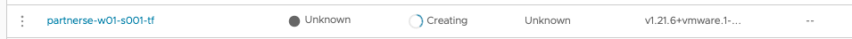

### In this section lets go through the steps to manage clusters in TMC using terraform. 

##### Check Terraform Version

```execute
terraform version
```

##### Change the directory

```execute
cd ~/terraform-demo
```

##### Read the terraform files

```execute
cat provider.tf
```

```execute
cat create-cg.tf
```

```execute
cat tkgs-create-cluster.tf
```

##### Edit and change the API token and org name in provider.tf file > Save

```execute
vi provider.tf
```

##### Initialize the providers

```execute
terraform init
```

##### Export the variable

```execute
export TF_VAR_SESSION_NAMESPACE=$SESSION_NAME
```

#### Create cluster group

```execute
terraform apply -target tanzu-mission-control_cluster_group.cluster_group_create_min_info -auto-approve
```

##### Solution for above failure is, change the name in create-cg.tf from cluster_group_create_min_info to create_cluster_group

```execute
vi create-cg.tf
```

```execute
terraform apply -target tanzu-mission-control_cluster_group.create_cluster_group -auto-approve
```

##### List the resources state

```execute
terraform state list
```

##### Create workload cluster with name as {{ session_namespace }}-tf

```execute
terraform apply -target tanzu-mission-control_cluster.create_tkgs_workload -auto-approve
```

##### Navigate to TMC Console to check the status of cluster creation, which generally takes 5-10 mins to complete. 

```dashboard:open-url
url: https://console.cloud.vmware.com/csp/gateway/discovery
```



##### Once completely deployed, execute below commands to delete the resources. 

##### Delete the cluster

```execute
terraform destroy -target tanzu-mission-control_cluster.create_tkgs_workload -auto-approve
```

##### Delete the cluster group

```execute
terraform destroy -target tanzu-mission-control_cluster_group.create_cluster_group -auto-approve
```
